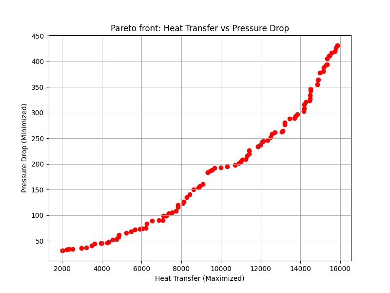

# Multi-Objective Optimization of a Thermal Energy System using Surrogate Modeling and NSGA-II

## 📌 Project Overview
This project demonstrates an end-to-end framework for optimizing a thermal energy system (e.g., a heat exchanger). Since high-fidelity physical simulations (like CFD) are computationally expensive, this project uses **Machine Learning** to create a surrogate model, coupled with a **Genetic Algorithm (NSGA-II)** to find the optimal trade-off between competing objectives.

## ⚙️ Methodology & Workflow
1. **Data Generation:** Simulated 1000 data points for a thermal system with 3 design variables (Flow Rate, Temperature, Length).
2. **Surrogate Modeling (AI):** Trained `RandomForestRegressor` models to learn the underlying thermodynamics and predict Heat Transfer and Pressure Drop in fractions of a second.
3. **Multi-Objective Optimization:** Formulated the problem using the `pymoo` library to **Maximize Heat Transfer** while **Minimizing Pressure Drop**.
4. **Decision Making:** Applied the Epsilon-Constraint method to filter out solutions exceeding the pump's physical limits and extracted the ultimate Golden Design Point.

## 📊 Results: The Pareto Front
The optimization successfully converged, generating a distinct Pareto front that physically proves the trade-off between heat transfer and pressure drop.

## 🛠️ Technologies Used
* **Python** (NumPy, Pandas)
* **Scikit-Learn** (Random Forest for Surrogate Modeling)
* **Pymoo** (NSGA-II for Evolutionary Optimization)
* **Matplotlib** (Data Visualization)
